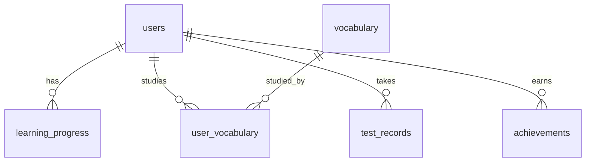
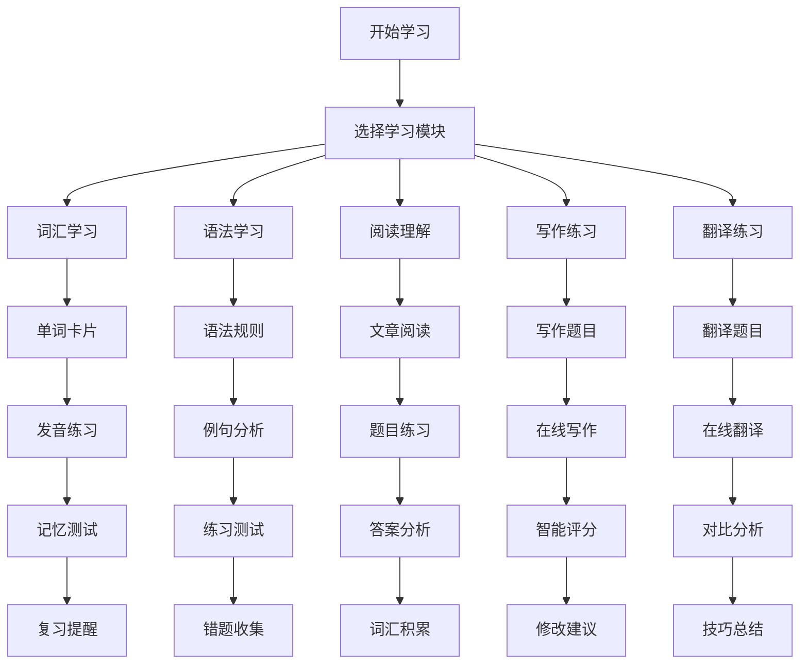

# 学位英语在线学习平台开发方案

## 📚 项目概述

### 项目背景
基于现有的学位英语学习系统，开发一个功能完整、交互性强的在线学习平台，将现有的Markdown学习资料转化为现代化的Web应用，提供更好的学习体验和更高的学习效率。

### 项目目标
- **用户体验**：提供直观、友好的学习界面
- **学习效果**：通过交互式学习提高学习效率
- **数据驱动**：基于学习数据分析提供个性化建议
- **社交学习**：构建学习社区，促进学习交流
- **移动优先**：支持多设备访问，随时随地学习

---

## 🎯 功能需求分析

### 一、核心学习功能

#### 1.1 词汇学习系统
- **智能单词卡片**：翻转式学习卡片
- **多种测试模式**：选择题、填空题、听写测试
- **发音练习**：语音识别和发音评分
- **记忆曲线**：基于艾宾浩斯遗忘曲线的复习提醒
- **词汇分类**：按字母、难度、主题分类学习

#### 1.2 语法学习系统
- **交互式语法练习**：实时语法检查和纠错
- **语法点解析**：详细的语法规则和例句
- **语法测试**：分层次的语法测试
- **错题本**：自动收集和复习错题

#### 1.3 阅读理解系统
- **文章阅读**：支持文本高亮和注释
- **题目练习**：多种题型的阅读理解练习
- **阅读分析**：阅读速度和理解度分析
- **词汇积累**：阅读中遇到的生词自动收集

#### 1.4 写作练习系统
- **智能写作助手**：实时语法检查和写作建议
- **写作模板**：提供各种文体的写作模板
- **评分系统**：AI辅助的写作评分
- **写作社区**：学生作品分享和互评

#### 1.5 翻译练习系统
- **汉译英练习**：句子和段落翻译
- **英译汉练习**：理解性翻译练习
- **翻译技巧**：翻译方法和技巧指导
- **对比学习**：原文与译文的对比分析

### 二、学习管理功能

#### 2.1 用户系统
- **用户注册登录**：支持邮箱、手机号注册
- **个人资料**：学习目标、水平评估、偏好设置
- **学习计划**：个性化学习计划制定
- **学习记录**：详细的学习历史记录

#### 2.2 进度跟踪
- **学习进度**：各模块学习进度可视化
- **成绩统计**：测试成绩和进步趋势
- **学习时长**：每日、每周、每月学习时长统计
- **成就系统**：学习徽章和成就解锁

#### 2.3 智能推荐
- **个性化推荐**：基于学习数据的智能推荐
- **薄弱环节**：自动识别学习薄弱点
- **复习提醒**：智能复习时间提醒
- **学习路径**：个性化学习路径规划

### 三、社交互动功能

#### 3.1 学习社区
- **讨论区**：学习问题讨论和经验分享
- **学习小组**：创建和加入学习小组
- **问答系统**：学习问题提问和回答
- **学习笔记**：分享学习笔记和心得

#### 3.2 竞赛系统
- **学习排行榜**：个人和小组排行榜
- **挑战赛**：定期举办学习挑战赛
- **积分系统**：学习积分和奖励机制
- **团队合作**：小组协作学习任务

### 四、管理功能

#### 4.1 内容管理
- **题库管理**：题目添加、编辑、分类
- **内容审核**：用户生成内容的审核
- **版本控制**：学习内容的版本管理
- **数据备份**：学习数据的安全备份

#### 4.2 数据分析
- **学习分析**：用户学习行为分析
- **效果评估**：学习效果评估报告
- **系统监控**：平台使用情况监控
- **用户反馈**：用户反馈收集和分析

---

## 🛠️ 技术架构设计

### 一、整体架构

#### 1.1 架构模式
```
┌─────────────────┐    ┌─────────────────┐    ┌─────────────────┐
│   前端应用      │    │   后端API       │    │   数据库        │
│   (React)       │◄──►│   (Node.js)     │◄──►│   (PostgreSQL)  │
└─────────────────┘    └─────────────────┘    └─────────────────┘
         │                       │                       │
         ▼                       ▼                       ▼
┌─────────────────┐    ┌─────────────────┐    ┌─────────────────┐
│   CDN/静态资源  │    │   缓存层        │    │   文件存储      │
│   (Vercel)      │    │   (Redis)       │    │   (AWS S3)      │
└─────────────────┘    └─────────────────┘    └─────────────────┘
```

#### 1.2 技术栈选择

**前端技术栈：**
- **框架**：Next.js 14 (React 18)
- **语言**：TypeScript
- **样式**：Tailwind CSS + Styled Components
- **状态管理**：Zustand + React Query
- **UI组件**：Ant Design + Headless UI
- **图表**：Chart.js / Recharts
- **动画**：Framer Motion

**后端技术栈：**
- **运行时**：Node.js 18+
- **框架**：Express.js / Fastify
- **语言**：TypeScript
- **ORM**：Prisma
- **认证**：JWT + Passport.js
- **文件上传**：Multer
- **邮件服务**：Nodemailer

**数据库：**
- **主数据库**：PostgreSQL 15
- **缓存**：Redis 7
- **搜索引擎**：Elasticsearch (可选)
- **文件存储**：AWS S3 / Cloudinary

**部署和运维：**
- **前端部署**：Vercel
- **后端部署**：Railway / DigitalOcean
- **数据库**：Supabase / PlanetScale
- **监控**：Sentry + LogRocket
- **CDN**：Cloudflare

### 二、数据库设计

#### 2.1 核心数据表

```sql
-- 用户表
CREATE TABLE users (
    id UUID PRIMARY KEY DEFAULT gen_random_uuid(),
    email VARCHAR(255) UNIQUE NOT NULL,
    username VARCHAR(100) UNIQUE NOT NULL,
    password_hash VARCHAR(255) NOT NULL,
    avatar_url VARCHAR(500),
    level VARCHAR(50) DEFAULT 'beginner',
    created_at TIMESTAMP DEFAULT NOW(),
    updated_at TIMESTAMP DEFAULT NOW()
);

-- 学习进度表
CREATE TABLE learning_progress (
    id UUID PRIMARY KEY DEFAULT gen_random_uuid(),
    user_id UUID REFERENCES users(id),
    module_type VARCHAR(50) NOT NULL, -- vocabulary, grammar, reading, writing, translation
    module_id VARCHAR(100) NOT NULL,
    progress_percentage INTEGER DEFAULT 0,
    last_studied_at TIMESTAMP,
    total_time_spent INTEGER DEFAULT 0, -- 秒
    created_at TIMESTAMP DEFAULT NOW(),
    updated_at TIMESTAMP DEFAULT NOW()
);

-- 词汇表
CREATE TABLE vocabulary (
    id UUID PRIMARY KEY DEFAULT gen_random_uuid(),
    word VARCHAR(100) NOT NULL,
    pronunciation VARCHAR(200),
    meaning TEXT NOT NULL,
    part_of_speech VARCHAR(50),
    difficulty_level INTEGER DEFAULT 1,
    examples JSONB,
    audio_url VARCHAR(500),
    created_at TIMESTAMP DEFAULT NOW()
);

-- 用户词汇学习记录
CREATE TABLE user_vocabulary (
    id UUID PRIMARY KEY DEFAULT gen_random_uuid(),
    user_id UUID REFERENCES users(id),
    vocabulary_id UUID REFERENCES vocabulary(id),
    mastery_level INTEGER DEFAULT 0, -- 0-5
    review_count INTEGER DEFAULT 0,
    last_reviewed_at TIMESTAMP,
    next_review_at TIMESTAMP,
    created_at TIMESTAMP DEFAULT NOW()
);

-- 测试记录表
CREATE TABLE test_records (
    id UUID PRIMARY KEY DEFAULT gen_random_uuid(),
    user_id UUID REFERENCES users(id),
    test_type VARCHAR(50) NOT NULL,
    test_data JSONB NOT NULL,
    score INTEGER,
    time_spent INTEGER,
    completed_at TIMESTAMP DEFAULT NOW()
);

-- 学习成就表
CREATE TABLE achievements (
    id UUID PRIMARY KEY DEFAULT gen_random_uuid(),
    user_id UUID REFERENCES users(id),
    achievement_type VARCHAR(50) NOT NULL,
    achievement_data JSONB,
    earned_at TIMESTAMP DEFAULT NOW()
);
```

#### 2.2 数据关系图



### 三、API设计

#### 3.1 RESTful API结构

```typescript
// API路由结构
/api
├── /auth
│   ├── POST /register
│   ├── POST /login
│   ├── POST /logout
│   └── POST /refresh
├── /users
│   ├── GET /profile
│   ├── PUT /profile
│   └── GET /progress
├── /vocabulary
│   ├── GET /words
│   ├── GET /words/:id
│   ├── POST /study
│   └── GET /review
├── /grammar
│   ├── GET /lessons
│   ├── GET /exercises
│   └── POST /submit
├── /reading
│   ├── GET /passages
│   ├── GET /questions
│   └── POST /answers
├── /writing
│   ├── POST /submit
│   ├── GET /feedback
│   └── GET /templates
├── /translation
│   ├── GET /exercises
│   └── POST /submit
└── /analytics
    ├── GET /progress
    ├── GET /performance
    └── GET /recommendations
```

#### 3.2 API响应格式

```typescript
// 统一响应格式
interface ApiResponse<T> {
  success: boolean;
  data?: T;
  error?: {
    code: string;
    message: string;
  };
  meta?: {
    page?: number;
    limit?: number;
    total?: number;
  };
}

// 示例：获取词汇列表
GET /api/vocabulary/words?page=1&limit=20&level=intermediate

Response:
{
  "success": true,
  "data": [
    {
      "id": "uuid",
      "word": "abandon",
      "pronunciation": "/əˈbændən/",
      "meaning": "放弃，抛弃",
      "part_of_speech": "verb",
      "difficulty_level": 2,
      "examples": [
        {
          "sentence": "He abandoned his car in the snow.",
          "translation": "他在雪地里抛弃了他的车。"
        }
      ]
    }
  ],
  "meta": {
    "page": 1,
    "limit": 20,
    "total": 1000
  }
}
```

---

## 🎨 用户界面设计

### 一、设计原则

#### 1.1 设计理念
- **简洁明了**：界面简洁，功能清晰
- **响应式设计**：适配各种设备尺寸
- **无障碍设计**：支持键盘导航和屏幕阅读器
- **一致性**：保持设计语言的一致性
- **可访问性**：符合WCAG 2.1标准

#### 1.2 色彩方案
```css
:root {
  /* 主色调 */
  --primary-color: #3b82f6;
  --primary-dark: #1d4ed8;
  --primary-light: #93c5fd;
  
  /* 辅助色 */
  --secondary-color: #10b981;
  --accent-color: #f59e0b;
  --danger-color: #ef4444;
  
  /* 中性色 */
  --gray-50: #f9fafb;
  --gray-100: #f3f4f6;
  --gray-200: #e5e7eb;
  --gray-300: #d1d5db;
  --gray-400: #9ca3af;
  --gray-500: #6b7280;
  --gray-600: #4b5563;
  --gray-700: #374151;
  --gray-800: #1f2937;
  --gray-900: #111827;
}
```

### 二、页面结构

#### 2.1 主要页面

**1. 首页 (Home)**
```jsx
const HomePage = () => (
  <div className="min-h-screen bg-gradient-to-br from-blue-50 to-indigo-100">
    <Header />
    <HeroSection />
    <FeatureSection />
    <ProgressOverview />
    <RecentActivity />
    <Footer />
  </div>
);
```

**2. 学习中心 (Learning Center)**
```jsx
const LearningCenter = () => (
  <div className="container mx-auto px-4 py-8">
    <LearningHeader />
    <div className="grid grid-cols-1 md:grid-cols-2 lg:grid-cols-3 gap-6">
      <VocabularyCard />
      <GrammarCard />
      <ReadingCard />
      <WritingCard />
      <TranslationCard />
      <ExamCard />
    </div>
  </div>
);
```

**3. 词汇学习页面**
```jsx
const VocabularyPage = () => (
  <div className="vocabulary-learning">
    <VocabularyHeader />
    <div className="learning-content">
      <WordCard />
      <ProgressBar />
      <TestSection />
      <ReviewSection />
    </div>
  </div>
);
```

#### 2.2 组件设计

**词汇卡片组件**
```jsx
const WordCard = ({ word, onAnswer, showAnswer }) => {
  const [flipped, setFlipped] = useState(false);
  const [userAnswer, setUserAnswer] = useState('');
  
  return (
    <div className="word-card-container">
      <div 
        className={`word-card ${flipped ? 'flipped' : ''}`}
        onClick={() => setFlipped(!flipped)}
      >
        <div className="card-front">
          <h2 className="word">{word.word}</h2>
          <button 
            className="pronunciation-btn"
            onClick={(e) => {
              e.stopPropagation();
              playPronunciation(word.audio);
            }}
          >
            🔊
          </button>
        </div>
        <div className="card-back">
          <p className="meaning">{word.meaning}</p>
          <div className="examples">
            {word.examples.map((example, index) => (
              <div key={index} className="example">
                <p>{example.sentence}</p>
                <p className="translation">{example.translation}</p>
              </div>
            ))}
          </div>
        </div>
      </div>
      
      <div className="quiz-section">
        <input
          type="text"
          value={userAnswer}
          onChange={(e) => setUserAnswer(e.target.value)}
          placeholder="请输入中文意思..."
          className="answer-input"
        />
        <button 
          onClick={() => onAnswer(userAnswer)}
          className="submit-btn"
        >
          提交答案
        </button>
      </div>
    </div>
  );
};
```

### 三、交互设计

#### 3.1 学习流程设计



#### 3.2 用户反馈设计

**即时反馈系统**
```jsx
const FeedbackSystem = ({ type, message, isVisible }) => {
  const feedbackTypes = {
    success: { icon: '✅', color: 'green' },
    error: { icon: '❌', color: 'red' },
    warning: { icon: '⚠️', color: 'yellow' },
    info: { icon: 'ℹ️', color: 'blue' }
  };
  
  return (
    <AnimatePresence>
      {isVisible && (
        <motion.div
          initial={{ opacity: 0, y: -20 }}
          animate={{ opacity: 1, y: 0 }}
          exit={{ opacity: 0, y: -20 }}
          className={`feedback ${feedbackTypes[type].color}`}
        >
          <span className="feedback-icon">
            {feedbackTypes[type].icon}
          </span>
          <span className="feedback-message">{message}</span>
        </motion.div>
      )}
    </AnimatePresence>
  );
};
```

---

## 📱 移动端适配

### 一、响应式设计

#### 1.1 断点设置
```css
/* Tailwind CSS 断点 */
@media (min-width: 640px) { /* sm */ }
@media (min-width: 768px) { /* md */ }
@media (min-width: 1024px) { /* lg */ }
@media (min-width: 1280px) { /* xl */ }
@media (min-width: 1536px) { /* 2xl */ }
```

#### 1.2 移动端优化
- **触摸友好**：按钮大小至少44px
- **手势支持**：滑动、点击、长按
- **离线支持**：PWA功能，支持离线学习
- **性能优化**：懒加载、代码分割

### 二、PWA功能

#### 2.1 Service Worker
```javascript
// service-worker.js
const CACHE_NAME = 'bachelor-english-v1';
const urlsToCache = [
  '/',
  '/static/js/bundle.js',
  '/static/css/main.css',
  '/manifest.json'
];

self.addEventListener('install', (event) => {
  event.waitUntil(
    caches.open(CACHE_NAME)
      .then((cache) => cache.addAll(urlsToCache))
  );
});

self.addEventListener('fetch', (event) => {
  event.respondWith(
    caches.match(event.request)
      .then((response) => {
        if (response) {
          return response;
        }
        return fetch(event.request);
      })
  );
});
```

#### 2.2 Web App Manifest
```json
{
  "name": "学位英语学习平台",
  "short_name": "英语学习",
  "description": "专业的学位英语在线学习平台",
  "start_url": "/",
  "display": "standalone",
  "background_color": "#ffffff",
  "theme_color": "#3b82f6",
  "icons": [
    {
      "src": "/icon-192x192.png",
      "sizes": "192x192",
      "type": "image/png"
    },
    {
      "src": "/icon-512x512.png",
      "sizes": "512x512",
      "type": "image/png"
    }
  ]
}
```

---

## 🔧 开发实施计划

### 一、开发阶段

#### 第一阶段：基础框架搭建 (2-3周)
**目标**：搭建项目基础架构和核心功能

**任务清单**：
- [ ] 项目初始化和环境配置
- [ ] 数据库设计和搭建
- [ ] 用户认证系统
- [ ] 基础UI组件库
- [ ] 词汇学习基础功能
- [ ] 简单的进度跟踪

**交付物**：
- 可运行的基础版本
- 用户注册登录功能
- 基础的词汇学习功能

#### 第二阶段：核心学习功能 (3-4周)
**目标**：实现主要学习模块

**任务清单**：
- [ ] 完整的词汇学习系统
- [ ] 语法学习模块
- [ ] 阅读理解功能
- [ ] 写作练习系统
- [ ] 翻译练习功能
- [ ] 学习进度可视化

**交付物**：
- 完整的学习功能
- 学习数据统计
- 基础的分析功能

#### 第三阶段：高级功能和优化 (2-3周)
**目标**：添加高级功能和性能优化

**任务清单**：
- [ ] 智能推荐系统
- [ ] 社交功能
- [ ] 移动端优化
- [ ] PWA功能
- [ ] 性能优化
- [ ] 安全加固

**交付物**：
- 功能完整的平台
- 移动端应用
- 性能优化报告

#### 第四阶段：测试和部署 (1-2周)
**目标**：全面测试和生产部署

**任务清单**：
- [ ] 功能测试
- [ ] 性能测试
- [ ] 安全测试
- [ ] 用户验收测试
- [ ] 生产环境部署
- [ ] 监控和日志

**交付物**：
- 生产环境部署
- 测试报告
- 运维文档

### 二、团队配置

#### 2.1 核心团队
- **项目经理** (1人)：项目管理和协调
- **前端开发** (2人)：React/Next.js开发
- **后端开发** (2人)：Node.js/API开发
- **UI/UX设计** (1人)：界面设计和用户体验
- **测试工程师** (1人)：功能测试和质量保证

#### 2.2 技能要求
**前端开发**：
- React/Next.js 3年以上经验
- TypeScript 熟练使用
- Tailwind CSS 或类似CSS框架
- 移动端开发经验

**后端开发**：
- Node.js 3年以上经验
- PostgreSQL 数据库经验
- RESTful API 设计经验
- 云服务部署经验

### 三、技术难点和解决方案

#### 3.1 数据迁移
**难点**：将现有Markdown文件转换为结构化数据
**解决方案**：
```javascript
// 数据转换脚本
const convertMarkdownToJSON = async () => {
  const fs = require('fs');
  const path = require('path');
  const matter = require('gray-matter');
  
  const vocabularyData = [];
  const files = fs.readdirSync('./AI单词');
  
  for (const file of files) {
    const content = fs.readFileSync(path.join('./AI单词', file), 'utf8');
    const { data, content: markdown } = matter(content);
    
    // 解析Markdown内容，提取词汇信息
    const words = parseVocabularyFromMarkdown(markdown);
    vocabularyData.push(...words);
  }
  
  // 保存到数据库
  await saveVocabularyToDatabase(vocabularyData);
};
```

#### 3.2 实时学习分析
**难点**：实时分析用户学习行为
**解决方案**：
```javascript
// 学习分析服务
class LearningAnalytics {
  async trackLearningEvent(userId, eventType, data) {
    // 记录学习事件
    await this.recordEvent(userId, eventType, data);
    
    // 实时分析
    const analysis = await this.analyzeLearningPattern(userId);
    
    // 更新推荐
    await this.updateRecommendations(userId, analysis);
  }
  
  async generateInsights(userId) {
    const userData = await this.getUserLearningData(userId);
    const insights = {
      strengths: this.identifyStrengths(userData),
      weaknesses: this.identifyWeaknesses(userData),
      recommendations: this.generateRecommendations(userData)
    };
    
    return insights;
  }
}
```

#### 3.3 性能优化
**难点**：大量学习数据的高效处理
**解决方案**：
- **数据库优化**：索引优化、查询优化
- **缓存策略**：Redis缓存热点数据
- **CDN加速**：静态资源CDN分发
- **代码分割**：按需加载减少初始包大小

---

## 💰 成本预算

### 一、开发成本

#### 1.1 人力成本
| 角色 | 人数 | 月薪(元) | 周期(月) | 小计(元) |
|------|------|----------|----------|----------|
| 项目经理 | 1 | 15,000 | 3 | 45,000 |
| 前端开发 | 2 | 12,000 | 3 | 72,000 |
| 后端开发 | 2 | 12,000 | 3 | 72,000 |
| UI/UX设计 | 1 | 10,000 | 2 | 20,000 |
| 测试工程师 | 1 | 8,000 | 2 | 16,000 |
| **总计** | **7** | - | - | **225,000** |

#### 1.2 技术成本
| 项目 | 费用(元/月) | 说明 |
|------|-------------|------|
| 云服务器 | 500 | 后端API服务器 |
| 数据库 | 300 | PostgreSQL云数据库 |
| CDN | 200 | 静态资源加速 |
| 域名SSL | 100 | 域名和SSL证书 |
| 监控服务 | 200 | 错误监控和性能监控 |
| **总计** | **1,300** | **月运营成本** |

### 二、运营成本

#### 2.1 年度运营成本
- **服务器费用**：6,000元/年
- **域名费用**：100元/年
- **SSL证书**：500元/年
- **监控服务**：2,400元/年
- **备份存储**：1,200元/年
- **总计**：10,200元/年

#### 2.2 维护成本
- **技术维护**：2,000元/月
- **内容更新**：1,000元/月
- **用户支持**：1,500元/月
- **总计**：4,500元/月

### 三、总成本估算

| 阶段 | 成本(元) | 说明 |
|------|----------|------|
| 开发成本 | 225,000 | 一次性开发费用 |
| 第一年运营 | 64,200 | 服务器+维护费用 |
| 后续年度 | 54,000 | 年度运营成本 |
| **总计(3年)** | **343,200** | **包含开发和3年运营** |

---

## 📊 风险评估

### 一、技术风险

#### 1.1 开发风险
**风险**：技术实现复杂度超出预期
**影响**：开发周期延长，成本增加
**缓解措施**：
- 采用成熟的技术栈
- 分阶段开发，及时调整
- 预留20%的缓冲时间

#### 1.2 性能风险
**风险**：大量用户并发访问性能问题
**影响**：用户体验下降
**缓解措施**：
- 负载测试和性能优化
- 使用CDN和缓存策略
- 数据库读写分离

### 二、市场风险

#### 2.1 竞争风险
**风险**：市场上已有类似产品
**影响**：用户获取困难
**缓解措施**：
- 差异化定位，专注学位英语
- 提供更好的用户体验
- 建立用户社区

#### 2.2 用户接受度风险
**风险**：用户对在线学习接受度不高
**影响**：用户增长缓慢
**缓解措施**：
- 用户调研和需求分析
- 免费试用和推广
- 持续改进用户体验

### 三、运营风险

#### 3.1 数据安全风险
**风险**：用户数据泄露
**影响**：法律风险和用户信任
**缓解措施**：
- 数据加密和访问控制
- 定期安全审计
- 购买网络安全保险

#### 3.2 内容质量风险
**风险**：学习内容质量不高
**影响**：学习效果差，用户流失
**缓解措施**：
- 专业教师审核内容
- 用户反馈机制
- 持续内容优化

---

## 🚀 上线计划

### 一、发布策略

#### 1.1 内测阶段 (2周)
**目标用户**：内部团队和少量种子用户
**功能范围**：核心学习功能
**目标**：发现和修复主要问题

#### 1.2 公测阶段 (4周)
**目标用户**：100-500名测试用户
**功能范围**：完整功能
**目标**：收集用户反馈，优化体验

#### 1.3 正式发布 (持续)
**目标用户**：所有目标用户
**功能范围**：完整功能+持续优化
**目标**：大规模用户增长

### 二、推广策略

#### 2.1 内容营销
- **学习博客**：分享英语学习技巧
- **视频教程**：制作学习指导视频
- **社交媒体**：微博、微信、抖音推广

#### 2.2 合作推广
- **教育机构**：与高校和培训机构合作
- **KOL合作**：与英语学习博主合作
- **口碑营销**：用户推荐奖励机制

#### 2.3 免费策略
- **免费试用**：新用户免费试用7天
- **免费功能**：基础功能永久免费
- **限时优惠**：定期推出优惠活动

---

## 📈 成功指标

### 一、用户指标

#### 1.1 用户增长
- **注册用户数**：目标10,000人/年
- **活跃用户数**：目标3,000人/月
- **用户留存率**：7日留存率>60%
- **用户满意度**：NPS评分>50

#### 1.2 学习效果
- **学习完成率**：课程完成率>70%
- **测试通过率**：平均测试通过率>80%
- **学习时长**：平均每日学习时长>30分钟
- **进步幅度**：用户学习水平提升>20%

### 二、业务指标

#### 2.1 收入指标
- **付费转化率**：免费用户转付费>5%
- **ARPU值**：平均每用户收入>100元/年
- **LTV/CAC**：用户生命周期价值/获客成本>3:1
- **月收入增长**：月收入增长率>20%

#### 2.2 运营指标
- **系统可用性**：99.9%在线时间
- **响应时间**：页面加载时间<3秒
- **错误率**：系统错误率<0.1%
- **用户反馈**：用户问题解决时间<24小时

---

## 🔮 未来规划

### 一、功能扩展

#### 1.1 短期规划 (6个月内)
- **AI智能助手**：基于GPT的智能学习助手
- **语音识别**：口语练习和发音纠正
- **直播课程**：在线直播英语课程
- **学习社区**：更丰富的社交功能

#### 1.2 中期规划 (1年内)
- **移动APP**：原生iOS和Android应用
- **VR学习**：虚拟现实英语学习体验
- **个性化AI**：更精准的个性化推荐
- **企业版**：面向企业的英语培训解决方案

#### 1.3 长期规划 (2年内)
- **国际化**：支持多语言版本
- **AI教师**：完全AI驱动的个性化教学
- **区块链认证**：学习成果的区块链认证
- **元宇宙学习**：元宇宙中的英语学习空间

### 二、技术演进

#### 2.1 技术升级
- **微服务架构**：从单体应用向微服务演进
- **AI/ML集成**：深度集成机器学习和AI技术
- **边缘计算**：利用边缘计算提升性能
- **5G优化**：针对5G网络优化应用体验

#### 2.2 数据驱动
- **大数据分析**：基于大数据的用户行为分析
- **预测分析**：预测用户学习需求和效果
- **智能推荐**：更精准的内容推荐算法
- **自动化运营**：基于数据的自动化运营决策

---

## 📝 总结

### 项目价值
这个学位英语在线学习平台项目具有以下价值：

1. **教育价值**：为学位英语学习者提供系统、高效的学习工具
2. **商业价值**：具有清晰的商业模式和盈利前景
3. **技术价值**：展示现代Web开发技术和AI应用
4. **社会价值**：促进英语教育普及和质量提升

### 成功关键因素
1. **用户体验**：简洁易用的界面和流畅的学习体验
2. **内容质量**：高质量的学习内容和科学的课程设计
3. **技术稳定**：稳定可靠的系统性能和良好的扩展性
4. **持续创新**：不断优化功能和引入新技术

### 建议
1. **分阶段实施**：按照计划分阶段开发，降低风险
2. **用户导向**：始终以用户需求为中心进行产品设计
3. **数据驱动**：基于数据分析进行产品优化和决策
4. **持续改进**：建立持续改进的机制和文化

这个项目有很好的发展前景，通过合理的规划和执行，可以成为一个成功的在线教育产品。

---

*文档版本：v1.0*  
*创建日期：2025年1月*  
*最后更新：2025年1月*
